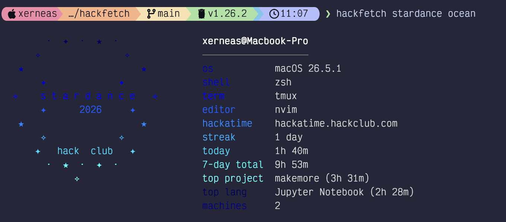
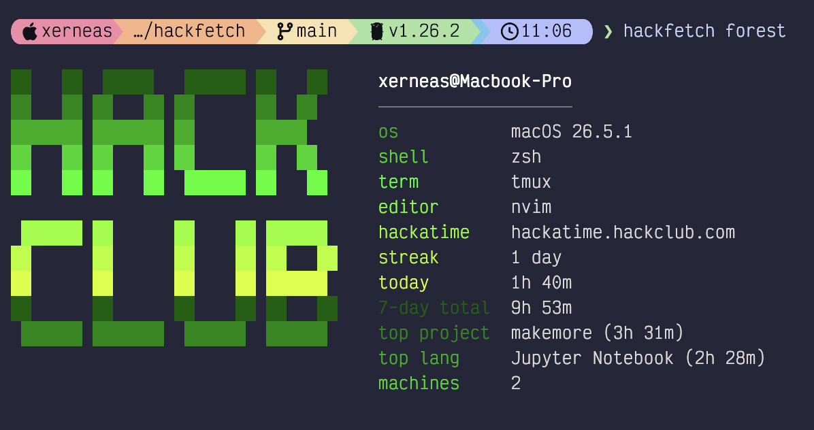
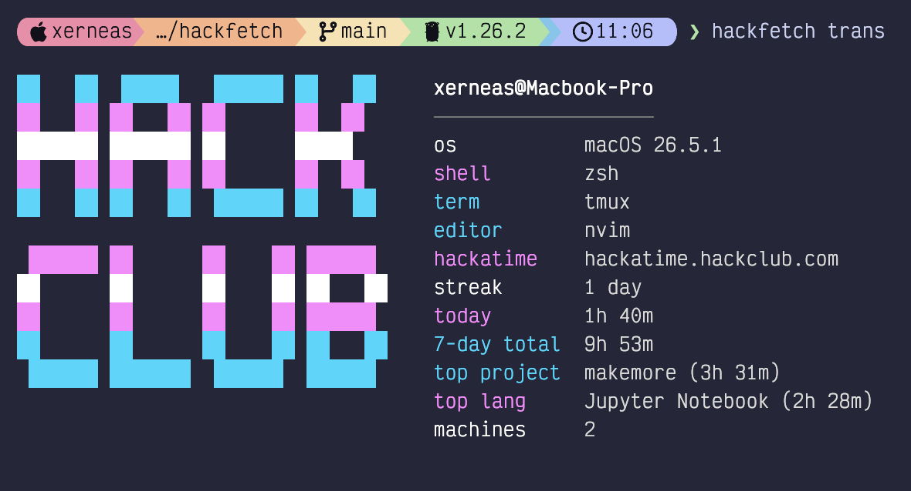
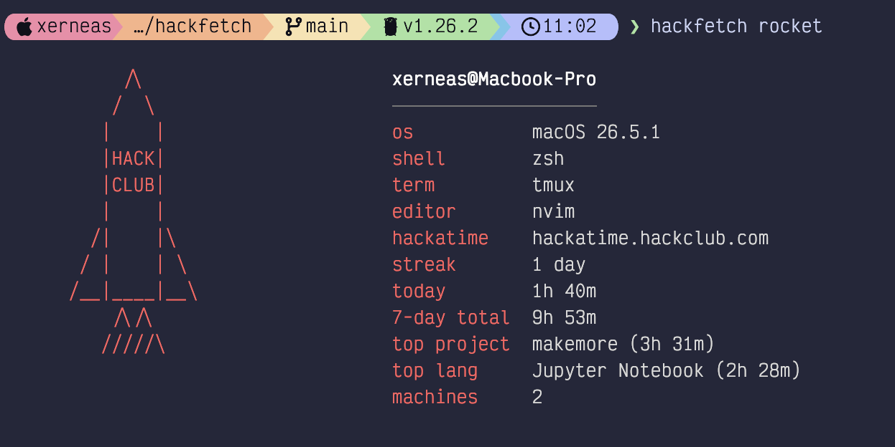
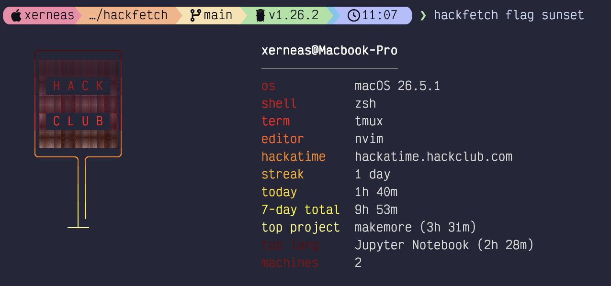
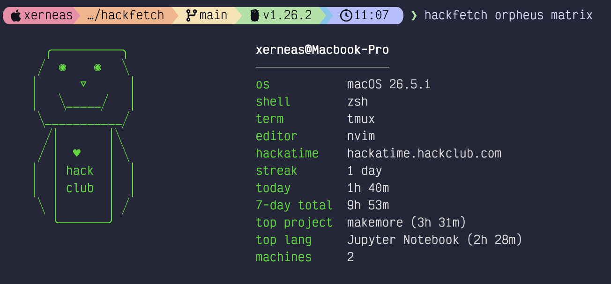

# hackfetch

A Hack Club themed system fetch with live [Hackatime](https://hackatime.hackclub.com) stats. Shows your system info next to a customizable Hack Club logo, plus your today/weekly hours, top project, top language, streak, and more - all from your terminal.

Built for [Stardance](https://stardance.hackclub.com) ✦

<p align="center">
  
</p>

---

## Install

### Homebrew

```sh
brew tap xerneas3318/tap
brew install hackfetch
```

### Go

```sh
go install github.com/xerneas3318/hackfetch@latest
```

### From source

```sh
git clone https://github.com/xerneas3318/hackfetch
cd hackfetch
go build -o hackfetch .
```

---

## Setup

hackfetch reads `~/.wakatime.cfg`. If you don't have one yet, run Hack Club's official Hackatime setup:

```sh
curl -fsSL https://raw.githubusercontent.com/hackclub/hackatime-setup/main/install.sh | bash
```

Or run `hackfetch -setup` and follow the prompt - it'll walk you through opening [hackatime.hackclub.com/my/wakatime_setup](https://hackatime.hackclub.com/my/wakatime_setup) and waiting for the config to be written.

---

## Usage

```sh
hackfetch                              # defaults
hackfetch stardance rainbow            # positional shorthand
hackfetch logo flag color pride        # keyword form
hackfetch -logo orpheus -color ocean   # flag form
hackfetch -v                           # verbose: + top editor, top category
hackfetch -list                        # show all logos and colors
hackfetch -h                           # help
hackfetch -setup                       # (re-)configure hackatime
hackfetch -no-net                      # offline mode
```

### Set defaults

Add to your `~/.zshrc` or `~/.bashrc`:

```sh
export HACKFETCH_LOGO=stardance
export HACKFETCH_COLOR=rainbow
export HACKFETCH_VERBOSE=1
```

---

## Gallery

<table>
  <tr>
    <td align="center">
      <br>
      <code>hackfetch forest</code>
    </td>
    <td align="center">
      <br>
      <code>hackfetch trans</code>
    </td>
  </tr>
  <tr>
    <td align="center">
      <br>
      <code>hackfetch rocket</code>
    </td>
    <td align="center">
      <br>
      <code>hackfetch flag sunset</code>
    </td>
  </tr>
  <tr>
    <td align="center">
      <br>
      <code>hackfetch orpheus matrix</code>
    </td>
    <td align="center">
      <br>
      <code>hackfetch stardance ocean</code>
    </td>
  </tr>
</table>

---

## Logos

`hackclub` &nbsp; `stardance` &nbsp; `flag` &nbsp; `orpheus` &nbsp; `rocket`

## Color schemes

`hackclub` &nbsp; `orange` &nbsp; `mono` &nbsp; `mute` &nbsp; `matrix` &nbsp; `rainbow` &nbsp; `pride` &nbsp; `sunset` &nbsp; `ocean` &nbsp; `forest` &nbsp; `stardance` &nbsp; `trans`

Run `hackfetch -list` any time to see the current set.

---

## What you get from Hackatime

When your `~/.wakatime.cfg` points at a working Hackatime account, hackfetch fetches and shows:

- **today** - hours coded today
- **7-day total** - hours coded over the past week
- **streak** - consecutive days with activity
- **slack** - your Hack Club / Hackatime handle
- **top project / project** - most-worked project (today and weekly)
- **top lang / language** - most-used language (with smart fallback: when Hackatime reports `unknown`, hackfetch infers from file extensions in your heartbeat history and labels it `(inferred)`)
- **machines** - when you've coded on more than one machine in the past 7 days
- **top editor / editor used** - *(verbose)* most-used editor (`-v`)
- **top category / category** - *(verbose)* coding / debugging / building / etc. (`-v`)

---

## Links

- [Stardance](https://stardance.hackclub.com) - the Hack Club hackathon this was built for
- [Hackatime](https://hackatime.hackclub.com) - Hack Club's WakaTime-compatible backend
- [Hack Club](https://hackclub.com) - the worldwide community of teen hackers
- [nFetch](https://github.com/aaronsbytes/nfetch) - fast, dependency-free Go system-fetch that inspired the architecture here
- [neofetch](https://github.com/dylanaraps/neofetch) - the original genre-defining fetch (now archived)

---

## License

MIT
